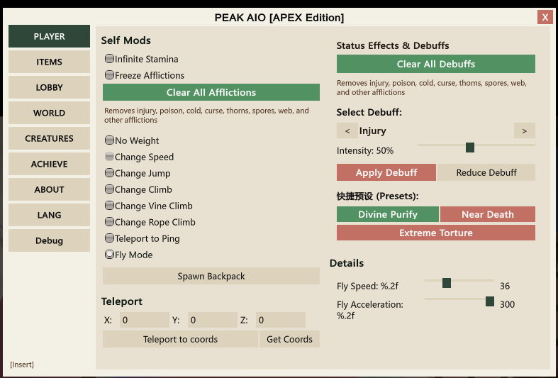

<div align="center">



# PEAK AIO APEX Mod

[](https://github.com/elliot35/PEAK-AIO-int/stargazers)
[](https://github.com/elliot35/PEAK-AIO-int/network/members)
[](https://github.com/elliot35/PEAK-AIO-int/graphs/contributors)


[](https://thunderstore.io/c/peak/p/k1r_gamer/PEAK_AIO_APEX/)

An all-in-one menu mod for [**PEAK**](https://store.steampowered.com/app/3527290/PEAK/) (Steam AppID: `3527290`) offering player enhancements, inventory customization, full multiplayer synchronization & anti-exploit revives, custom map navigation ribbons, creature spawning, and Steam achievement management.

Built purely on **Native Unity IMGUI (`OnGUI`)** with zero DirectX hooking, completely eliminating DirectX 12/DirectX 11/Vulkan graphics crashes.

</div>

---

## Table of Contents

- [Key Highlights](#key-highlights)
- [Features](#features)
  - [1. Player (Self Mods & Status Manager)](#1-player-self-mods--status-manager)
  - [2. Items (4-Slot Inventory & Weapon Enchantments)](#2-items-4-slot-inventory--weapon-enchantments)
  - [3. Lobby (Multiplayer, Revives & Network Defense)](#3-lobby-multiplayer-revives--network-defense)
  - [4. World (Route Ribbon & Safe Navigation)](#4-world-route-ribbon--safe-navigation)
  - [5. Creatures (Host Spawner & Aggro Control)](#5-creatures-host-spawner--aggro-control)
  - [6. Achievements (Steam Achievement Manager)](#6-achievements-steam-achievement-manager)
  - [7. Debug & Diagnostics](#7-debug--diagnostics)
  - [8. UI & Localization](#8-ui--localization)
- [Requirements](#requirements)
- [Installation](#installation)
- [Opening the Menu](#opening-the-menu)
- [Configuration](#configuration)
- [Advanced Feature Guide](#advanced-feature-guide)
  - [Fly Mode Controls](#fly-mode-controls)
  - [Blowgun Dart Enchantment & Revive Darts](#blowgun-dart-enchantment--revive-darts)
  - [Duplication-Proof Inventory Revive](#duplication-proof-inventory-revive)
  - [Route Flow Ribbon & Next Campfire Navigation](#route-flow-ribbon--next-campfire-navigation)
  - [Creature Spawning & Aggro](#creature-spawning--aggro)
- [Troubleshooting](#troubleshooting)
- [Screenshots](#screenshots)
- [Building from Source](#building-from-source)
- [Credits & Contributors](#credits--contributors)
- [Disclaimer](#disclaimer)

---

## Key Highlights

- **Crash-Free Native IMGUI**: No external DirectX hooking DLLs (like DearImGuiInjection). Fully compatible with DX11, DX12, and Vulkan.
- **Zero-GC Memory Discipline**: Background textures, font styles, and palettes are statically allocated during initialization, ensuring zero stuttering and zero frame drops.
- **Dynamic CJK Font Fallback**: Dynamically resolves system fonts (`Microsoft YaHei`, `SimSun`, `MS Gothic`, `Malgun Gothic`) to ensure crisp text rendering across all supported languages.
- **Defensive Ground Alignment**: All teleports and segment transitions run through vertical physics raycasting and `Physics.SyncTransforms()`, preventing characters and creatures from falling into the void.
- **Atomic Duplication-Proof Revive**: Player revives capture binary inventory snapshots on death with a single-use token lock, preventing item cloning exploits.
- **Zero Hard-Dependency Map Integration**: Dynamically detects custom map mods (such as `PeakAMap`) via runtime reflection without requiring external assemblies.

---

## Features

### 1. Player (Self Mods & Status Manager)
- **Infinite Stamina** — Sprint, jump, and climb infinitely with no stamina drain.
- **Freeze Afflictions** — Lock all status timers and affliction levels at their current values.
- **Clear All Afflictions** — Instantly purge injury, poison, cold, curse, thorns, spores, cobwebs, etc.
- **No Weight** — Completely remove movement and jumping weight penalties from carried items and backpacks.
- **Locomotion Modifiers** — Independent configurable multipliers for **Movement Speed** (`1x - 20x`), **Jump Height** (`10 - 500`), **Climbing Speed**, **Vine Climb Speed**, and **Rope Climb Speed**.
- **No Fall Damage** — Optional safe-landing toggle paired with jump modifiers.
- **Free Flight Mode** — Omnidirectional flight with adjustable speed (`10 - 100`) and acceleration (`10 - 300`).
- **Teleport to Ping** — Instantly teleport to your in-game map ping location.
- **Coordinate Teleport** — Teleport directly to exact X / Y / Z world coordinates, with a one-click **Get Coords** reader.
- **Spawn Backpack** — Instantly spawn or equip a starter backpack.
- **12 Status Effects & Debuffs Inspector**:
  - Cycle through 12 native game afflictions: `Injury`, `Hunger`, `Cold`, `Poison`, `Crab`, `Curse`, `Drowsy`, `Weight`, `Hot`, `Thorns`, `Spores`, and `Web`.
  - Adjust intensity slider from `10%` to `100%`, then apply or subtract effect.
  - **Quick Presets**:
    - **Divine Purify**: Fully cleanses all afflictions and resets health to peak condition.
    - **Near Death**: Instantly inflicts critical bone fractures and life-threatening injuries.
    - **Extreme Torture**: Simultaneously applies poison, fractures, freezing, spiderwebs, and fungal spore parasites.

### 2. Items (4-Slot Inventory & Weapon Enchantments)
- **4-Slot Backpack Architecture**:
  - Individual editors for **Slot 1**, **Slot 2**, **Slot 3** (handheld items), and **Slot 4** (dedicated backpack slot).
  - Slot 4 features smart type filtering, listing only wearable backpack types.
  - Real-time search filters and scrollable catalogs for each slot.
  - One-click **Equip**, **Spawn in World**, and **Recharge / Durability** (`0% - 100%`) slider for handheld tools.
  - **Drop Current Backpack** button for slot 4.
  - Global item catalog dynamic refresh across scenes.
- **Mushroom Customization**:
  - Configure wild and harvested mushrooms: **Vanilla** (original random), **Purified** (guaranteed positive buff), **Toxic** (guaranteed poison/debuff), or **Specific** (exact effect ID 0–9).
- **Blowgun Dart Ammo Enchantments**:
  - Enchants blowgun darts with custom gameplay and network payloads:
    - **Buffs**: Invincibility, Speed Boost, Infinite Stamina, Full Cleanse, Low Gravity, Luminescence (Glow), and **Revive Dart** (remotely shoot a fallen teammate to instantly revive them!).
    - **Debuffs**: Lethal Poison, Starvation, Deep Sleep, Trip & Fall, Thorns, Spore Infestation, Blindness, and Numbness.
    - **Special**: Chaos (random outcome).
- **Survival Passives**:
  - **Food Poisoning Immunity** — Safely consume raw/spoiled meat and toxic mushrooms with zero poison risk.
  - **Infinite Tool Charge** — Torches, flare guns, lighters, lanterns, and battery-powered gadgets never deplete.

### 3. Lobby (Multiplayer, Revives & Network Defense)
- **Multiplayer Session Roster**:
  - Displays all connected Steam / Photon peers in real time.
- **Batch Actions (with "Exclude Self" option)**:
  - **Revive All** — Standard resurrection for all players.
  - **Revive All with Item Restore** — Restores dead teammates' exact inventories using atomic snapshots without duplication bugs.
  - **Kill All** & **Clear All Afflictions for All Players**.
  - **Warp All To Me** — Pulls all remote players directly to your current coordinates.
  - **Batch Give Items** — Distribute any selected catalog item to every player at once.
- **Single-Target Interactions**:
  - Target-specific Revive (Normal or Restore Inventory) and Kill.
  - Teleport to Player / Teleport Player to Me.
  - Remote Status Infliction / Cleansing / Extreme Torture preset.
  - **Remote Slot 4 Equip**: Instantly equip backpacks (`Backpack`, `Jetpack`, `Rocketpack`, `Fannypack`) directly to a remote player's back via authoritative game routines.
  - **Spawn Scoutmaster**: Summon the Scoutmaster enemy locked onto the target player (Host only).
- **Network Hardening & Protection Suite**:
  - **Network Tuning**: Optimizes Photon packet delivery (`MaxResendsBeforeDisconnect: 8`, 3 quick resends, CRC check enabled, 30 Hz dispatch rate) to eliminate network-jitter disconnects.
  - **Anti-Kick Protection**: Blocks malicious or accidental host-initiated kick RPCs.
  - **Auto-Reconnect**: Seamlessly recovers room connections if unexpectedly disconnected.

### 4. World (Route Ribbon & Safe Navigation)
- **Airport Lobby Phase**:
  - Displays island rotation timer, gate broadcasts, scheduled destinations, and difficulty ratings.
  - Seamlessly detects custom maps and playlist mods, displaying `[Custom Map]` tags.
  - **Route Flow Ribbon** preview & Playlist queue overview (Stage X of N, status tracking).
- **In-Island Expedition Phase**:
  - Current segment slice, level indicator (Levels 1–6), exact altitude display, and campfire status.
  - **Interactive Route Flow Ribbon** with real-time status markers:
    - `★` Current position
    - `✓` Ignited campfire / completed segment
    - `➔` Route progression path
- **Campfire & Segment Progression**:
  - **Teleport to Next Campfire** — Smart context-aware jump navigating to the next upcoming campfire, safe room, or the summit.
  - **Light Campfire** — Remotely ignite campfires to save progression.
  - **Summon Rescue Helicopter** — Peak-exclusive extraction trigger.
  - **Segment Jumps**: Safe teleportation with ground alignment to segment starts (Beach, Tropics, Alpine, Caldera, The Kiln, The Peak).
  - **Return to Airport** trigger.
- **Map Synchronization & Containers**:
  - Send map load RPCs to specific players or all peers.
  - **Force Sync Segment** — Synchronizes colliders and segments across clients to resolve invisible wall and void-falling bugs.
  - **Container Browser**: Scans luggage, chest, and cursed containers within 300 meters, sorted by distance. Supports one-click **Open All Nearby**, **Warp to Container**, or **Open Selected**.

### 5. Creatures (Host Spawner & Aggro Control)
- **Host Authority Indicator**: Displays real-time MasterClient authorization status.
- **6 Supported Spawns**:
  1. **Scoutmaster** (Host authority required)
  2. **BigGhost** (Supports `1.0x - 5.0x` scaling with quick 1x/2x/3x/5x buttons)
  3. **MushroomZombie** (Host authority required)
  4. **Scorpion**
  5. **Beetle**
  6. **BeeSwarm**
- **Spatial Anchors**: Spawn in front of Self, in front of Selected Player, or at Crosshair raycast point.
- **Distance Slider**: Adjust spawn distance (`1m - 50m`) with quick-set buttons (`5m`, `10m`, `20m`, `35m`).
- **Aggro Target Binding**: Lock creature AI aggro onto Self, Selected Player, or None (peaceful wandering).

### 6. Achievements (Steam Achievement Manager)
- **Real-Time Progress Tracking**: Live counter showing unlocked achievements vs. total valid game achievements (e.g., `15 / 15`).
- **Throttled Steamworks Queries**: IPC state queries throttled to 1s to prevent frame drops.
- **One-Click Sync Unlock All**: Unlocks all remaining Steam achievements simultaneously.
- **Multilingual Search**: Fuzzy search by localized achievement title, English title, or internal enum identifier.
- **Interactive Achievement Grid**: Two-column card grid displaying locked/unlocked state with individual one-click unlock triggers.

### 7. Debug & Diagnostics
- **Raw Slot Byte Inspector**: Dumps raw binary serialization payloads, GUIDs, and item metadata for slots 0–2 into the BepInEx log.
- **Origin Teleport**: One-click jump to coordinates `(0, 0, 0)` for coordinate calibration.

### 8. UI & Localization
- **Native Unity IMGUI**: Floating window with draggable header, clean sidebar navigation, and full graphics backend compatibility.
- **Configurable Hotkey**: Toggle overlay and cursor visibility with **`Insert`** (default) or any Unity `KeyCode`.
- **6 Full Languages**:
  - 🇬🇧 English
  - 🇨🇳 简体中文
  - 🇯🇵 日本語
  - 🇰🇷 한국어
  - 🇮🇹 Italiano
  - 🇹🇼 繁體中文

---

## Requirements

| Dependency | Version | Notes |
| :--- | :--- | :--- |
| **PEAK** | Latest Steam Release | Steam AppID: `3527290` |
| **BepInEx** | **5.4.23.3 (x64)** | **Strictly BepInEx 5.x**. Do NOT use BepInEx 6.x. |

> [!NOTE]
> **No External ImGui Injectors Required!** Unlike older mods, PEAK AIO APEX uses pure Unity native IMGUI rendering. It does not hook into DirectX or Vulkan swapchains, completely avoiding crashes across all graphics APIs.

---

## Installation

### Step 1 — Install BepInEx 5

1. Download **[BepInEx 5.4.23.3 (x64)](https://github.com/BepInEx/BepInEx/releases/tag/v5.4.23.3)** for Windows.
2. Locate your PEAK game installation directory:
   - In your Steam Library, right-click **PEAK** → **Manage** → **Browse local files**.
3. Extract the BepInEx zip contents **directly into the PEAK folder** so that the `BepInEx` folder sits next to `PEAK.exe`.
4. **Launch the game once** to generate the folder structure, then exit:
   ```
   PEAK/
   ├── BepInEx/
   │   ├── config/
   │   ├── plugins/
   │   └── ...
   ├── PEAK.exe
   └── ...
   ```

### Step 2 — Install PEAK AIO APEX

1. Download the latest `PEAK-AIO.dll` from Releases or build output.
2. Place `PEAK-AIO.dll` into your `PEAK/BepInEx/plugins/` directory:
   ```
   PEAK/
   └── BepInEx/
       └── plugins/
           └── PEAK-AIO.dll
   ```

### Step 3 — Play

1. Launch PEAK using any graphics renderer (**DirectX 11**, **DirectX 12**, or **Vulkan**).
2. Press **Insert** on your keyboard to toggle the menu overlay and unlock mouse input.

---

## Opening the Menu

- Default hotkey: **`Insert`**
- Pressing the hotkey toggles the native window and locks/unlocks mouse cursor control.
- To rebind the hotkey, see [Configuration](#configuration).

---

## Configuration

Settings and toggles automatically persist to the BepInEx configuration file when you run the mod:

```
PEAK/BepInEx/config/com.onigremlin.peakaio.cfg
```

### Hotkey Customization

```ini
[General]

## Key to toggle the mod menu overlay. Uses UnityEngine.KeyCode names.
# Setting type: KeyCode
# Default value: Insert
MenuToggleKey = Insert
```

Supported `KeyCode` names include `Home`, `Delete`, `F1`–`F12`, `RightShift`, `Backslash`, `Keypad0`, etc. (See [Unity KeyCode Documentation](https://docs.unity3d.com/ScriptReference/KeyCode.html)).

### Language Setting

```ini
[UI]

## Language: 0=English, 1=简体中文, 2=日本語, 3=한국어, 4=Italiano, 5=繁體中文
LanguageIndex = 0
```

---

## Advanced Feature Guide

### Fly Mode Controls
1. Go to the **Player** tab and check **Fly Mode**.
2. Controls while flying:
   - <kbd>W</kbd> <kbd>A</kbd> <kbd>S</kbd> <kbd>D</kbd> — Move horizontally in looking direction.
   - <kbd>Space</kbd> — Ascend vertically.
   - <kbd>Left Ctrl</kbd> — Descend vertically.
3. Adjust **Fly Speed** and **Fly Acceleration** in the *Details* sub-panel on the right.

### Blowgun Dart Enchantment & Revive Darts
1. Go to the **Items** tab.
2. Enable **Blowgun Dart Enchantment** and pick an effect.
3. Select **Revive**: Shooting a dead or incapacitated teammate with a blowgun dart will immediately resurrect them from a distance.
4. Select **Invincibility** or **SpeedBoost** for remote team support, or offensive options like **Lethal Poison** and **Blindness**.

### Duplication-Proof Inventory Revive
- Traditional revive mods often duplicate items when dead players drop their equipment and are subsequently revived with fresh gear.
- In PEAK AIO APEX, the mod captures an **atomic binary snapshot** (`Globals.deathSnapshots`) at the exact moment of death.
- Clicking **Revive & Restore** marks the token as consumed, cleanses duplicate dropped items, and restores the player's exact slot layout safely.

### Route Flow Ribbon & Next Campfire Navigation
- The **World** tab features an active route ribbon displaying your current level, altitude, and upcoming checkpoints.
- Use **Teleport to Next Campfire** to auto-detect your location and smoothly advance to the next safe area without skipping crucial quest flags.
- Built-in `Physics.SyncTransforms()` and safe ground raycasting eliminate falling through terrain when loading new world slices.

### Creature Spawning & Aggro
1. Ensure you are the room host (MasterClient) for restricted entities (Scoutmaster, MushroomZombie).
2. Choose a spatial anchor (e.g. **Crosshair** to spawn where you are aiming).
3. Set **Aggro Binding** to **Selected Player** to direct the spawned creature's attention toward an ally or threat.

---

## Troubleshooting

| Issue | Cause & Solution |
| :--- | :--- |
| **Menu does not appear when pressing `Insert`** | Ensure `PEAK-AIO.dll` is located in `PEAK/BepInEx/plugins/`. If another app uses `Insert`, change `MenuToggleKey` in `BepInEx/config/com.onigremlin.peakaio.cfg`. |
| **Game crashes on startup** | Verify you are using **BepInEx 5.4.23.3 (x64)**, **not BepInEx 6.x**. Ensure obsolete hooking mods like `DearImGuiInjection` have been removed. |
| **Player falls through the ground after teleporting** | PEAK streams terrain dynamically. Use the mod's **Teleport to Campfire** or **Force Sync Segment** in the World tab to ensure terrain colliders are synchronized before moving. |
| **Host-only features not working** | Features such as **Spawn Scoutmaster** and map RPC loading require the local player to be the session host (MasterClient). |
| **Config file is missing** | The config file is generated after your first game launch with the mod installed. |
| **Fly mode moves too slowly** | Increase both **Fly Speed** and **Fly Acceleration** sliders in the Player tab. |

---

## Screenshots

<div align="center">

### Latest Native IMGUI Interface


<br/>

### Multilingual Support (Chinese UI Showcase)


<br/>

### Core Feature Tabs
<p align="center">
  
  
</p>
<p align="center">
  
</p>

</div>

---

## Building from Source

### Prerequisites
- Visual Studio 2022 (or later) with **.NET desktop development** workload.
- .NET Framework 4.7.2 targeting pack.
- PowerShell 5.1+ (for automated script execution).

### Local Dependency Architecture
> [!IMPORTANT]
> This repository uses **zero NuGet package dependencies** for core game logic. All 19 required assemblies are pre-packaged in `PEAK-AIO/References/` (including BepInEx, 0Harmony, UnityEngine modules, Photon, and game runtimes).

### Build Commands

- **Method 1: PowerShell Script (Recommended)**
  ```powershell
  .\build.ps1 -Configuration Release
  ```
  *Automatically detects `MSBuild.exe` via `vswhere` or Visual Studio installation paths, builds in Release mode, and copies the output `PEAK-AIO.dll` to the repository root.*

- **Method 2: Batch Script**
  ```cmd
  build.bat
  ```

- **Method 3: Direct MSBuild CLI**
  ```cmd
  msbuild PEAK-AIO.sln /p:Configuration=Release /p:Platform="Any CPU" /v:minimal
  ```

Output binaries will be placed at `PEAK-AIO/bin/Release/PEAK-AIO.dll` and mirrored to the repository root.

---

## Credits & Contributors

- **[PEAK-AIO](https://github.com/OniSensei/PEAK-AIO)** — Original mod foundation by OniSensei.
- **[HarmonyX](https://github.com/BepInEx/HarmonyX)** — Runtime bytecode patching engine.
- **[BepInEx](https://github.com/BepInEx/BepInEx)** — Unity modding and plugin framework.
- **[Penswer](https://github.com/Penswer/Peak-Everything)** — Technical insight and game exploration.
- **[Luluberlu](https://thunderstore.io/c/peak/p/Luluberlu/)** — Flight mode reference logic.

### Contributors
<table>
  <tr>
    <td align="center">
      <a href="https://github.com/elliot35">
        <br />
        <sub><b>elliot35</b></sub>
      </a>
    </td>
    <td align="center">
      <a href="https://github.com/leonardogrimaldi">
        <br />
        <sub><b>leonardogrimaldi</b></sub>
      </a>
    </td>
    <td align="center">
      <a href="https://github.com/OniSensei">
        <br />
        <sub><b>OniSensei</b></sub>
      </a>
    </td>
  </tr>
</table>

---

## Disclaimer

This mod is provided for **educational and personal use only**. It is not affiliated with, maintained by, or endorsed by the developers or publishers of PEAK. Use responsibly. Multiplayer tools can impact the gameplay experience of other participants in your session.
