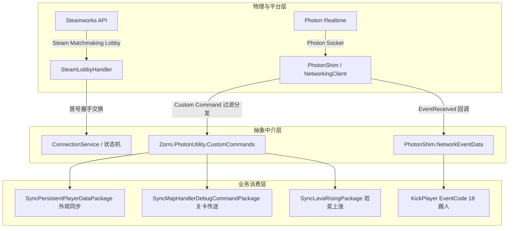

# 《PEAK》网络事件、自定义命令与 P2P 协议规范

本文档详尽梳理游戏《PEAK》底层基于 `PhotonNetwork.RaiseEvent` 构建的事件系统、Zorro 引擎的 `CustomCommands` 二进制网络包协议，以及基于 Steamworks Lobby 的房间发现与 P2P 握手协议。

---

## 一、网络协议架构总览

游戏在 Photon PUN2 的基础之上，分层构建了高度模块化的网络通信层：



---

## 二、Photon 原生事件与 EventCode 规范

游戏通过 `PhotonNetwork.NetworkingClient.EventReceived` 注册总事件拦截器，将 Photon 原生事件分发给业务逻辑。

### 1. 踢人事件 (EventCode: 18)

| 项目 | 规范定义 |
| :--- | :--- |
| **事件代码 (EventCode)** | `18` (对应 `CustomCommandType.KickPlayer`) |
| **触发接口** | `Peak.Network.PhotonShim.Kick(string userId)` |
| **发送权限约束** | 强校验 `NetCode.Session.IsHost == true`（仅房主/MasterClient 有权发起） |
| **发送参数 (RaiseEventOptions)** | `RaiseEventOptions.Default` (广播给房间内所有客户端) |
| **传输模式 (SendOptions)** | `SendOptions.SendReliable` (可靠传输，保证必达) |
| **数据载荷 (Payload)** | `string userId` (被踢出玩家的 Photon/Steam UserId 字符串) |
| **业务处理逻辑** | 在 `PlayerHandler.OnNetworkEvent(INetworkEventData eventData)` 中接收：<br>当 `eventData.EventCode == 18` 时，比对目标玩家并触发断开连接逻辑。 |

> [!TIP]
> **Mod 防踢补丁思路**：通过 Harmony Patch 拦截客户端的 `PlayerHandler.OnNetworkEvent` 或 `PhotonShim.RaiseGenericEvent`，当检测到 `EventCode == 18` 且目标为本地玩家时直接阻断，即可实现“防房主踢出”。

---

## 三、Zorro.PhotonUtility 二进制命令系统 (CustomCommands)

为了避免频繁使用 PUN 反射开销并减少数据封包体积，开发团队引入了 `Zorro.PhotonUtility` 框架。所有自定义业务数据包均继承自 `CustomCommandPackage<CustomCommandType>`。

### 1. 命令类型枚举 (`CustomCommandType`)

```csharp
public enum CustomCommandType : byte
{
    INVALID = 0,
    SyncPersistentPlayerData = 1,     // 玩家外观与持久化数据同步
    SyncMapHandlerDebugCommand = 2,   // 关卡段落跳转与玩家集体传送
    ClosedEndScreen = 3,              // 结算画面关闭通知
    SyncLavaRising = 4,               // 岩浆蔓延上升状态同步
    KickPlayer = 18                   // 房主踢人指令
}
```

### 2. 生命周期注册机制

当游戏网络状态机流转至 `InRoomState.Enter()`（成功进入房间时），初始化全局命令监听器并注册数据包模型：

```csharp
CommandListener commandListener = CustomCommands<CustomCommandType>.SpawnCommandListener<CommandListener>();
commandListener.RegisterPackage<SyncPersistentPlayerDataPackage>(new SyncPersistentPlayerDataPackage());
commandListener.RegisterPackage<SyncMapHandlerDebugCommandPackage>(new SyncMapHandlerDebugCommandPackage());
commandListener.RegisterPackage<SyncLavaRisingPackage>(new SyncLavaRisingPackage());
```

---

### 3. 核心数据包序列化协议

每个数据包使用 `Zorro.Core.Serizalization.BinarySerializer` 与 `BinaryDeserializer` 进行紧凑字节流打包：

#### ① `SyncPersistentPlayerDataPackage` (CommandType = 1)
- **用途**: 广播或单播同步玩家的角色捏脸、服装配色、饰品等持久化自定义外观。
- **传输模式**: `SendReliable` (可靠传输)
- **发送场景**:
  1. 本地玩家修改外观配置后，通过 `PersistentPlayerDataService.SetPlayerData` 向全房间广播。
  2. 新玩家加入房间时，老玩家通过 `PersistentPlayerDataService.SyncToPlayer` 单播给新玩家 (`TargetActors = [newPlayer.ActorNumber]`)。
- **二进制数据包结构**:
  | 偏移/顺序 | 字段名 | 类型 | 字节大小 | 描述 |
  | :--- | :--- | :--- | :--- | :--- |
  | 1 | `ActorNumber` | `int` | 4 字节 | 该外观所属玩家的 Photon ActorNumber |
  | 2 | `Data` | `PersistentPlayerData` | 变长 | 嵌套序列化 `CharacterCustomizationData`（包含皮肤、眼睛、发型、衣服等索引） |

#### ② `SyncMapHandlerDebugCommandPackage` (CommandType = 2)
- **用途**: 关卡段落跳跃、全员坐标集体跃迁（如跳过教程岛、直接进入特定海拔区域）。
- **传输模式**: `SendReliable`
- **发送点**: `MapHandler.JumpToSegmentLogic(Segment targetSegment, ..., sendToEveryone = true)`
- **二进制数据包结构**:
  | 顺序 | 字段名 | 类型 | 说明 |
  | :--- | :--- | :--- | :--- |
  | 1 | `Segment` | `byte` | 目标关卡分段枚举（`Segment` 包含 Beach, Jungle, Alpine, Peak 等） |
  | 2 | `Length` | `byte` | 本次需要传送的玩家数量 $N$ |
  | 3.. | `PlayerToTeleport[i]` | `int` (循环 $N$ 次) | 目标玩家的 ActorNumber 列表 |

> [!NOTE]
> **Mod 应用场景**：Mod 开发者可直接构造此包并通过 `CustomCommands<CustomCommandType>.SendPackage(new SyncMapHandlerDebugCommandPackage { ... })` 发送，实现**一键带全队跳过关卡**。

#### ③ `SyncLavaRisingPackage` (CommandType = 4)
- **用途**: 火山岛地图中岩浆蔓延上涨的统一时序同步。
- **二进制数据包结构**:
  | 顺序 | 字段名 | 类型 | 说明 |
  | :--- | :--- | :--- | :--- |
  | 1 | `Started` | `bool` (1 字节) | 岩浆上涨是否已正式启动 |
  | 2 | `Ended` | `bool` (1 字节) | 岩浆是否已到达最高点停止 |
  | 3 | `Time` | `float` (4 字节) | 岩浆自启动以来的运行秒数 (`timeTraveled`) |
  | 4 | `TimeWaited` | `float` (4 字节) | 初始等待倒计时 (`secondsWaitedToStart`) |

---

## 四、Steam Lobby 握手与房间发现机制

游戏依赖 Steam 平台进行私密房间的大厅创建与互联握手，具体由 `SteamLobbyHandler` 负责。

### 1. 握手消息枚举 (`SteamLobbyHandler.MessageType : byte`)

```csharp
public enum MessageType : byte
{
    INVALID = 0,
    RequestRoomID = 1,   // 进房者 -> 房主：请求分配/获取对应的 Photon 房间名
    RoomID = 2           // 房主 -> 进房者：响应返回 Photon 真实房间名字符串
}
```

### 2. 握手交互时序图

```
客户端 (Client)                                房主 (Host)
      |                                              |
      |--------- 1. 加入 Steam Lobby -------------->|
      |                                              |
      |<-------- 2. 获取 Lobby Metadata -------------|
      |   (读取 PhotonRegion, PeakVersion, Scene)    |
      |                                              |
      |--------- 3. SendLobbyChatMsg --------------->|
      |   [Payload: byte 1 (RequestRoomID)]          |
      |                                              |
      |<-------- 4. SendLobbyChatMsg ----------------|
      |   [Payload: byte 2 (RoomID) + ASCII RoomName]|
      |                                              |
      |== 5. 解析 RoomName 并切换连接状态 ==           |
      |   若当前 PhotonRegion 不一致 -> 重连目标区域   |
      |   调用 PhotonNetwork.JoinRoom(RoomName)     |
      |==============================================|
```

### 3. Steam Lobby Metadata 键值规范

房主在创建 Steam 大厅后，通过 `SteamMatchmaking.SetLobbyData` 发布以下全局键值：

| Metadata Key | 数据格式 | 说明与示例 |
| :--- | :--- | :--- |
| `"PhotonRegion"` | `string` | Photon 物理服务器区域代码，如 `"eu"`, `"us"`, `"asia"` |
| `"PeakVersion"` | `string` | 游戏客户端版本号校验码，版本不一致时拒绝连接 |
| `"CurrentScene"` | `string` | 当前游戏加载的场景名，用于客户端提前预加载（默认 `"Airport"`） |

---

## 五、网络连接状态机流转规范 (`ConnectionService.StateMachine`)

游戏的网络生命周期完全由 `ConnectionService` 驱动，核心状态包括：

1. **`DefaultConnectionState`**: 初始离线状态，未接入 Photon 或未创建大厅。
2. **`HostState`**:
   - 初始化 `RoomOptions`：`IsVisible = false`, `MaxPlayers = 4`, `PublishUserId = true`。
   - 调用 `PhotonNetwork.CreateRoom(roomName, roomOptions)`。
   - 创建 Steam Lobby 并将大厅类型设为好友可见或私密。
3. **`JoinSpecificRoomState`**:
   - 检查本地客户端 `PhotonNetwork.CloudRegion` 是否与目标匹配。
   - 若不匹配先执行 `PhotonNetwork.ConnectToRegion(region)`。
   - 握手成功后调用 `PhotonNetwork.JoinRoom(roomName)`。
4. **`InRoomState`**:
   - 挂载并注册 `CommandListener`。
   - 重置全局玩家就绪标志位 `hasClosedEndScreen = false`。
   - 启动房主心跳协程，定时刷新 Steam Lobby 数据。
